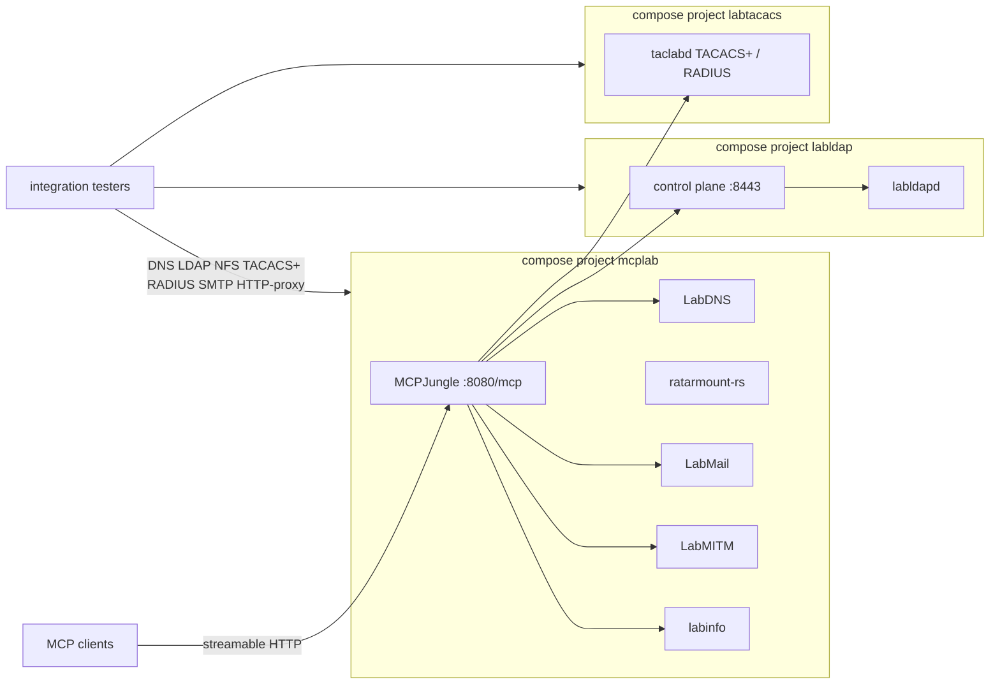

<p align="center">
  
</p>

<h1 align="center">MCP Integration Lab</h1>

<p align="center">
  One gateway. Every lab protocol.<br />
  DNS, LDAP, TACACS+, RADIUS, mail, NFS, and HTTP intercept — YAML-configured, ephemeral, ready for integration tests.
</p>

<p align="center">
  <a href="https://hilather.github.io/mcp-integration-lab/">Documentation</a>
  ·
  <a href="https://hilather.github.io/mcp-integration-lab/start.html">Quick start</a>
  ·
  <a href="https://hilather.github.io/mcp-integration-lab/configure.html">Configure</a>
  ·
  <a href="CONTRIBUTING.md">Contributing</a>
  ·
  <a href="https://github.com/hilather/mcp-integration-lab">Source</a>
</p>

<p align="center">
  
  
  
  
  
</p>

A docker-compose laboratory that publishes real network protocols on the host and drives them from a single [Model Context Protocol](https://modelcontextprotocol.io) gateway. Configuration lives in a profile directory. Runtime state is tmpfs and a restart wipes it.

This is laboratory software. It is not a production identity or mail system.

## Quick start

```bash
git clone https://github.com/hilather/mcp-integration-lab.git
cd mcp-integration-lab
make up      # vendor, secrets, images, start, register
make smoke   # DNS / LDAP / NFS / TACACS+ / RADIUS / mail / LabMITM through the gateway
```

Needs Docker Engine 24+ with Compose v2.24.4+, GNU make, and Go 1.26+. First run vendors the service repos and builds images; later runs reuse them.
Older Compose releases fail validation of the LabLDAP overlay; use v2.24.4 or newer.

Point an MCP client at the gateway. The default profile runs enterprise mode, so send the minted client token:

```json
{
  "mcpServers": {
    "integration-lab": {
      "url": "http://<lab-host>:8080/mcp",
      "headers": {
        "Authorization": "Bearer <contents of secrets/mcp-client-token>"
      }
    }
  }
}
```

The curated tool group is `http://<lab-host>:8080/v0/groups/integration/mcp`. In development mode (`LAB_DEV_MODE=true`) drop the `Authorization` header.

Ask **labinfo** for `endpoints_list` (web/REST URLs) and `connections_list` (protocol client config) before you spelunk.

Full walkthrough: [Quick start](https://hilather.github.io/mcp-integration-lab/start.html) · [docs/guides/quickstart.md](docs/guides/quickstart.md)

## What you get

| Service | Role | Default host ports |
| --- | --- | --- |
| **LabDNS** | Authoritative lab DNS: overrides, wildcards, forwarding, bounded chaos, operator console | 10053 udp/tcp · REST/MCP/UI 18080 |
| **LabLDAP** | Native Go directory (`labldapd`) + control plane | 3389 / 3636 · HTTPS 8443 |
| **TacLab** | TACACS+ (legacy + TLS 1.3) and RADIUS | 49 / 300 · 1812 / 1813 · HTTP 18049 |
| **LabMail** | Receive-only SMTP sink + UI / REST / MCP (compose service `maildev`) | 1025 · 1080 |
| **LabMITM** | HTTP(S) intercepting forward proxy + inspector / REST / MCP | 18888 · 18088 |
| **ratarmount-rs** | Archive-backed userspace NFSv3 with a write overlay | 20490 |
| **labinfo** | Service directory MCP (`endpoints_list`, `connections_list`) | 18090 |
| **MCPJungle** | Single MCP gateway, tool groups, optional ACLs | 8080 |

Every port is published on all interfaces so remote systems can test against the lab. Values live in the active profile, not in compose files.



## Configure

Team-variable configuration lives in `profiles/<name>/`. Copy `profiles/default` to start a team profile.

```
profiles/<name>/
  profile.env              ports, LAB_PUBLIC_HOST, LAB_DEV_MODE, storage
  dev-credentials.yaml     lab-only catalog (used iff LAB_DEV_MODE=true)
  labdns/bootstrap.yaml    permanent DNS zones and records
  labldap/scenario.yaml    directory users, ACLs, TLS, MCP features
  labinfo/services.yaml    endpoint + connection catalog
  labmail/bootstrap.yaml   LabMail desired state (relay keys rejected)
  labmitm/bootstrap.yaml   LabMITM desired state (exact Origins; no "*")
  mcpjungle/servers/*.json gateway registrations
  mcpjungle/groups/        curated tool groups
```

Select it with `PROFILE=` in `.env` (see [`.env.example`](.env.example)) or per invocation: `make up PROFILE=teamx`. Process env overrides `.env`, which overrides `profile.env`.

Team-local profiles under `profiles/<name>/` (other than `default`) are gitignored — see [`profiles/README.md`](profiles/README.md). Do not leave stale port overrides in `.env` (for example `LABDNS_DNS_PORT=10053` while your profile sets `53`) — `make preflight` rejects that drift.

A LabDNS zone from the default profile:

```yaml
zones:
  - id: lab-zone
    name: lab.test.
    mode: authoritative
    records:
      - { id: ns1-a,  owner: ns1,  type: A, values: [10.42.0.53] }
      - { id: ldap-a, owner: ldap, type: A, values: [10.42.0.40] }
      - { id: tools-wildcard-a, owner: "*.tools", type: A, values: [10.42.0.20] }
```

A LabLDAP seed from the same profile — native engine, no cleartext bind:

```yaml
directory:
  engine: native
  suffix: "dc=example,dc=test"
users:
  - { id: alice, uid: alice, passwordFile: /run/secrets/user-alice, enabled: true }
groups:
  - id: staff
    members: [{ user: alice }]
```

TacLab’s users, policies, PKI, and shared secrets are generated by its `labgen` tool on first `make up`. The profile owns the `TACLAB_*` host ports. In `LAB_DEV_MODE=true`, `mcplab secrets` then pins lab-user passwords and AAA shared secrets from `dev-credentials.yaml` (PKI stays labgen-random).

`LAB_DEV_MODE` is the single security knob. `false` (default) hardens the gateway, redacts credentials from labinfo, and mints random secrets. `true` opens the gateway, lets labinfo reveal tokens and connection secrets, and reconciles those files from `dev-credentials.yaml` (the default profile ships `lab-dev-*` values; they are inert unless this knob is on). Never default a shared team profile to dev mode.

Configuration reference with every variable and a working snippet for each service: [Configure](https://hilather.github.io/mcp-integration-lab/configure.html) · [docs/guides/configuration.md](docs/guides/configuration.md)

## Everyday commands

`make` targets are thin wrappers over `cmd/mcplab`.

| Command | What it does |
| --- | --- |
| `make up` | Vendor, secrets, fixtures, full stack, gateway registration (idempotent) |
| `make reload APP=<app>` | Rebuild/recreate one app (see below). Not a full redeploy. |
| `make down` | Stop. Bind-mounted storage survives. |
| `make reset` | Stop and wipe all runtime state |
| `make register` | Reapply gateway JSON from the active profile |
| `make preflight` | Fail fast on profile drift and unavailable host ports |
| `make smoke` | End-to-end scenario through the gateway |
| `make test` | `go vet` + unit/regression tests for the CLI |

`APP` is one of `labdns`, `maildev`, `nfs`, `labinfo`, `mcpjungle`, `labldap`,
`labtacacs`, `labmitm`. Use this after editing that service's YAML or bumping its image.
Gateway reload (`APP=mcpjungle`) also re-runs `make register` because
registration SQLite is tmpfs. `make labldap-up` / `make labtacacs-up` remain
idempotent bring-up of those compose projects.

`make up` and `make register` run the same preflight check automatically. To
bypass intentionally, set `MCPLAB_ALLOW_PROFILE_OVERRIDES=true`. Use `make up`
for first bring-up, a vendor pin bump, or a profile switch.

## Projects in this lab

This repository owns orchestration, profiles, secrets layout, and gateway policy. The appliances are separate projects:

| Project | What it is |
| --- | --- |
| [hilather/go-lab-dns](https://github.com/hilather/go-lab-dns) | Laboratory DNS with overrides, wildcards, suffix forwarding, bounded chaos, and an embedded operator console. YAML desired state, REST + MCP. Pinned **v1.1.0**. |
| [hilather/go-lab-ldap-mcp](https://github.com/hilather/go-lab-ldap-mcp) ([site](https://hilather.github.io/go-lab-ldap-mcp/)) | Disposable directory laboratory. Native Go engine (default as of v0.3), REST, MCP, and a browser UI. Pinned **v0.3.0**. |
| [hilather/go-lab-tacacs-mcp](https://github.com/hilather/go-lab-tacacs-mcp) ([site](https://hilather.github.io/go-lab-tacacs-mcp/)) | TacLab: TACACS+ (RFC 8907 + RFC 9887 TLS 1.3), RADIUS, REST/MCP, embedded operator UI. Pinned **v1.3.0**. |
| [hilather/go-lab-maildev](https://github.com/hilather/go-lab-maildev) | LabMail: receive-only SMTP sink, inbox UI, `/email` compat, `/v1`, MCP. Pinned **v1.0.0-rc.3**. Compose service name stays `maildev`. |
| [hilather/go-lab-mitmproxy](https://github.com/hilather/go-lab-mitmproxy) | LabMITM: laboratory HTTP(S) intercepting forward proxy, flow-inspector UI, `/v1`, MCP. Pinned **v1.1.0**. Data plane is unauthenticated; intercept is :443 only. |
| [hilather/ratarmount-rs](https://github.com/hilather/ratarmount-rs) | Native Rust rewrite of ratarmount. Here, a writable archive-backed userspace NFSv3 export. Pinned **v0.1.24**. |
| [mcpjungle/MCPJungle](https://github.com/mcpjungle/MCPJungle) ([docs](https://docs.mcpjungle.com)) | Self-hosted MCP gateway — the single client endpoint for this lab. |
| [mark3labs/mcp-go](https://github.com/mark3labs/mcp-go) | Go SDK for the Model Context Protocol. Used by labinfo and spoken by the gateway client. |

Vendored checkouts live in `third_party/` (cloned by `mcplab vendor`). Do not edit them in place — add a patch under `patches/` and send it upstream.

## Architecture and security

Three compose projects (`mcplab`, `labldap`, `labtacacs`) meet on the external docker network `mcplab-shared`. Internal hops use static bearer tokens. Gateway registration state sits on tmpfs; `make register` reapplies the profile JSON.

Design, topology, and the phase-1 OAuth plan: [docs/architecture.md](docs/architecture.md).

How to contribute: [CONTRIBUTING.md](CONTRIBUTING.md). Agent working rules: [AGENTS.md](AGENTS.md). Change summaries: [CHANGELOG.md](CHANGELOG.md).

## Data-plane examples

```bash
dig @<lab-host> -p 10053 ns1.lab.test

# LDAPS — trust third_party/go-lab-ldap-mcp/secrets/tls/ca.crt
# cert SAN is "directory"
ldapsearch -H ldaps://<lab-host>:3636 \
  -D 'uid=alice,ou=people,dc=example,dc=test' -W \
  -b dc=example,dc=test '(uid=alice)'

# SMTP sink — nothing is relayed
# point the system under test at <lab-host>:1025, then open :1080

mount -t nfs -o vers=3,tcp,nolock,port=20490,mountport=20490 \
  <lab-host>:/ /mnt
# writable empty root; overlay commits into fixtures.tar.zst every 15m
```

## Status

POC. v0.4.0. Local images. Laboratory static tokens. Contributions that keep configuration in profiles and runtime state ephemeral are welcome.
