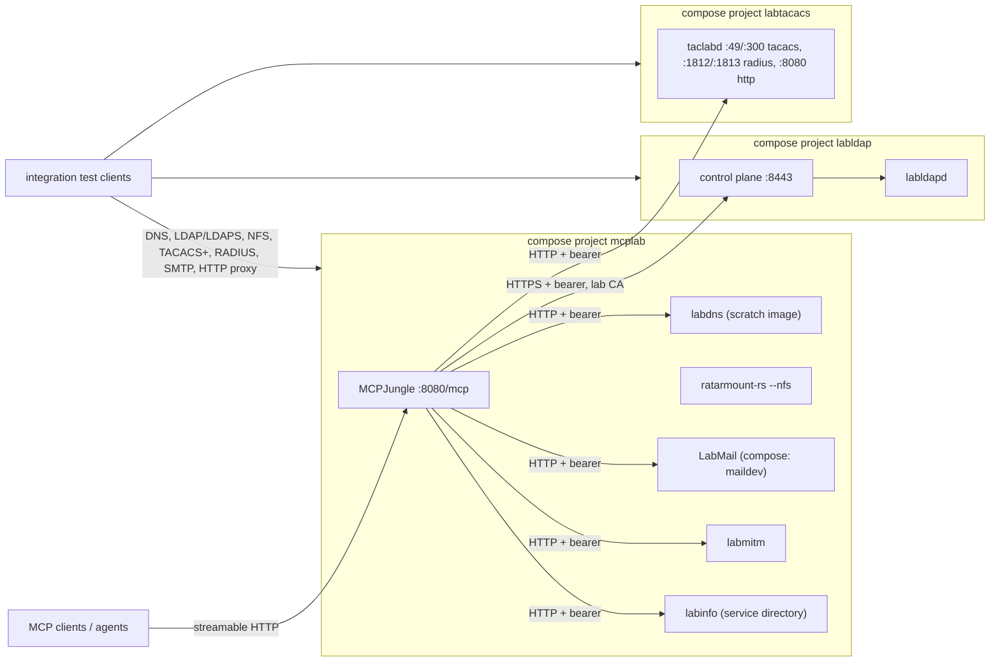

# MCP Integration Lab — Architecture

Published overview: [hilather.github.io/mcp-integration-lab](https://hilather.github.io/mcp-integration-lab/).
Guides: [quickstart](guides/quickstart.md), [configuration](guides/configuration.md).

A docker-compose orchestrated suite of AI-ready lab services behind a single
MCP gateway endpoint. Services are YAML-configured for permanence; runtime
state is ephemeral and wiped on restart. This repo owns all configuration,
secrets layout, and gateway policy.


## Services (POC)

| Service | Role | MCP | External host ports (default profile) |
| --- | --- | --- | --- |
| LabDNS (`go-lab-dns` **v1.1.0**) | Lab DNS: overrides, wildcards, forwarding, chaos, operator console | `http://labdns:8080/mcp` (bearer) | DNS 10053 (UDP/TCP), REST/MCP/UI 18080 |
| LabLDAP (`go-lab-ldap-mcp` **v0.3.0**) | Native Go directory (`labldapd`) with control plane | `https://control:8443/mcp` (bearer, lab CA) | LDAP 3389 / LDAPS 3636, control HTTPS 8443 |
| TacLab (`go-lab-tacacs-mcp` **v1.3.0**) | TACACS+ (legacy + TLS 1.3) and RADIUS lab appliance | `http://taclab:8080/mcp` (bearer) | TACACS+ 49/300, RADIUS 1812/1813 (UDP), RadSec 2083 / DAS 3799 (default off), control HTTP 18049 |
| LabMail (`go-lab-maildev` **v1.0.0-rc.3**, compose service `maildev`) | Receive-only SMTP sink with inbox UI, `/email` compat, `/v1`, MCP | `http://maildev:1080/mcp` (bearer; `allowLegacyClients: true`) | SMTP 1025, web 1080 |
| LabMITM (`go-lab-mitmproxy` **v1.1.0**) | HTTP(S) intercepting forward proxy with flow-inspector UI, `/v1`, MCP | `http://labmitm:8088/mcp` (bearer; `allowLegacyClients: true`) | proxy 18888 (unauthenticated), inspector 18088 |
| ratarmount-rs **v0.1.24** | Archive-backed userspace NFSv3 export with write overlay + 15m live commit | none yet (phase 1 wrapper) | NFS 20490 |
| labinfo (first-party) | Service directory: user-facing URLs + protocol connection details (+credentials in dev mode) | `http://labinfo:8080/mcp` (bearer) | 18090 |
| MCPJungle | MCP gateway: aggregation, tool groups, ACLs | `http://<host>:8080/mcp` | gateway 8080 |

All host ports are profile-defined (`profiles/<name>/profile.env`) and bind on
all interfaces: the lab exists for remote systems to test against. Container-
internal ports are fixed and irrelevant to consumers.

## Topology



- The compose projects meet on the shared external docker network
  `mcplab-shared`. REST/management planes are published externally too (they
  are part of what teams integration-test), authenticated by bearer tokens or
  TLS.
- Gateway registration state (SQLite) sits on tmpfs: ephemeral by design.
  `make register` reapplies the JSON configs in the active profile's
  `mcpjungle/` directory, which are the source of truth.
- LabLDAP's control plane serves TLS from a lab-CA-signed cert
  (`setuptls generate --management` + scenario `tls.mode: files`); the gateway
  trusts the CA via `SSL_CERT_FILE`.

## Configuration ownership

Per-team configuration lives in profiles (`profiles/<name>/`), selected via
`PROFILE` (`.env` or environment). Within the active profile:

- `profile.env` — host ports, gateway mode, container storage paths,
  NFS overlay-commit interval.
- `labdns/bootstrap.yaml` — LabDNS desired state (read-only mount; MCP
  `dns_state_reset` returns to it).
- `labldap/scenario.yaml` — LabLDAP scenario (users, groups, ACLs,
  tokens; MCP mutations enabled for agent-driven scenarios).
- `labmail/bootstrap.yaml` — LabMail desired state (`labmail.dev/v1alpha1`;
  `internal/maildev` rejects leftover `maildev/maildev.yaml` and every
  relay/outbound key). Compose service name stays `maildev`.
- `labmitm/bootstrap.yaml` — LabMITM desired state (`labmitm.dev/v1alpha1`;
  lab-owned overlay copy, exact Origins, `allowLegacyClients: true`).
- `mcpjungle/servers/*.json` — upstream registrations with
  `${ENV}` token injection.
- `mcpjungle/groups/integration.json` — curated tool-group endpoint.

TacLab is generated rather than hand-written: its `labgen` tool materializes
the full lab baseline (combined TACACS+RADIUS config, PKI, shared secrets,
lab-user passwords) into `third_party/go-lab-tacacs-mcp/deployments/compose/`
on first `mcplab secrets`; the lab runs that bundle as compose project
`labtacacs` with an overlay for the shared network, and the profile owns
the host ports (`TACLAB_*`). In `LAB_DEV_MODE=true`, `internal/taclabcfg`
pins the secret files to `dev-credentials.yaml` after labgen (PKI and YAML
stay generated).

Outside profiles: `secrets/` and `third_party/*/secrets/` — generated, gitignored.
`profiles/<name>/dev-credentials.yaml` is documented lab-only catalog (the
default profile ships `lab-dev-*` values) and is inert unless `LAB_DEV_MODE=true`.
Container storage is profile-definable (`NFS_ARCHIVE_DIR`, `NFS_DATA_DIR`);
the NFS work dir is a host bind mount so it gets real disk for indexes and
the durable write overlay. The archive dir is also writable: live overlay
commit (`--commit-overlay-interval` / `--commit-overlay-on-exit`) copies the
`.tar.zst` and atomically replaces it (last-frame rewrite; plan 2× compressed
headroom).

## Orchestration CLI

All lifecycle operations are implemented by a typed Go CLI (`cmd/mcplab`,
packages under `internal/`); make targets are thin wrappers. Pure logic
(profile/env precedence, mcpjungle CLI output parsing, fixture archives) is
separated from the exec layer and covered by unit/regression tests
(`make test`). Changes to orchestration behavior require tests where the
logic is testable without docker.

`make up` is the full bring-up (vendor, secrets, fixtures, all three compose
projects, gateway registration). `mcplab reload <app>` / `make reload
APP=<app>` rebuilds and recreates **one** application so a YAML or image
tweak does not bounce the rest of the lab:

| App | What reload does | Runtime state discarded |
| --- | --- | --- |
| `labdns` | `compose up --no-deps --force-recreate labdns` | in-process DNS overlay / sessions |
| `maildev` | same for compose service `maildev` | captured inbox |
| `nfs` | same for `nfs` (on-exit overlay commit runs first) | NFS client mounts; overlay already committed |
| `labinfo` | same for `labinfo` | none (catalog is bind-mounted YAML) |
| `mcpjungle` | recreate gateway, then `register` | tmpfs SQLite (re-applied from profile JSON) |
| `labldap` | rebuild images, force-recreate directory + control, re-run bootstrap | ephemeral `/data` (re-seeded from scenario.yaml) |
| `labtacacs` | `compose up --force-recreate` on the TacLab project | in-process AAA state (labgen files on disk survive) |
| `labmitm` | same for compose service `labmitm` | captured flows; generate-mode CA rotates |

`make labldap-up` / `make labtacacs-up` stay idempotent project bring-up
(used by `make up`). Use full `make up` after a vendor pin bump, a profile
switch, or first run.

## Security model

One profile knob, `LAB_DEV_MODE` (default `false`), drives the posture.
Internal hops always use static bearer tokens on an isolated docker network.

- Hardened (`LAB_DEV_MODE=false` → gateway `enterprise`): clients must present
  the token in `secrets/mcp-client-token`; per-client server allow-lists
  apply. labinfo redacts credentials and only describes auth. Secret files
  are random-if-missing. Leaving dev mode (marker `secrets/.lab-dev-mode`)
  unlinks and remints orchestrator tokens, runs LabLDAP `setupsecrets --force`,
  and `labgen -force`.
- Dev (`LAB_DEV_MODE=true` → gateway `development`): no client auth, and the
  labinfo tools reveal credentials — `endpoints_list` each web service's
  token, `connections_list` the on-the-wire secrets (LDAP bind password,
  RADIUS shared secret) — all staged world-readable in
  `secrets/labinfo-creds/` (lab-grade static secrets, gitignored).
  `mcplab secrets` writes the active profile's `dev-credentials.yaml` into
  those files, including TacLab lab-user passwords and AAA shared secrets
  after labgen (fail-closed if the catalog is missing; no merge with
  `default`). The default profile ships `lab-dev-*` values; they are inert
  unless this knob is on. Catalog reconcile never inspects `MCPJUNGLE_MODE`.
  `MCPJUNGLE_MODE` can still be pinned explicitly to decouple the gateway
  from reveal. `Secrets()` reloads running containers whose files changed
  (or when the marker is missing / `reloads` is not `done`, so a crash
  retries against leftover LabLDAP `/data`) and re-registers the gateway
  when registrar tokens change; `make up` skips those apps.

labinfo's catalog (`profiles/<name>/labinfo/services.yaml`) requires a
`connection` block per service — protocol endpoints, client parameters (LDAP
DNs, DNS zones, NFS mount options, SMTP posture, AAA specifics), and
connection credentials — so agents can configure clients and systems under
test without human spelunking. labinfo fails to start if a service lacks one
(fail-closed, AGENTS.md rule 9).

### Phase 1: OAuth/OIDC/SAML at the proxy layer

The tools do not need modification. MCP authorization is defined at the HTTP
transport: an OAuth 2.1 resource/authorization server fronts the MCP endpoint.
The plan is a chained auth proxy in front of the gateway:

```
client -> auth proxy (OAuth 2.1 + OIDC discovery) -> mcpjungle -> services
```

- Candidate proxies: `oauth2-proxy` (battle-tested, ext-auth style) or
  `babs/mcp-auth-proxy` (implements the RFC 8414/7591/9728/7636 discovery and
  dynamic-registration chain MCP clients expect out of the box).
- IdP: Keycloak (or Dex) as a lab container. SAML support comes from Keycloak
  brokering (SAML upstream -> OIDC downstream), so SAML also requires no tool
  changes.
- MCPJungle currently lacks downstream OAuth; the chained proxy keeps auth
  swappable and gateway-agnostic.

Phase 1 also adds a thin stdio MCP wrapper for ratarmount-rs (mount/unmount/
list exports via its control interface), registered in MCPJungle, plus
per-persona tool groups and OTel metrics scraping.

## Design notes / limitations

- LabDNS is pinned to **v1.1.0**. MCP Streamable HTTP is wired into `serve`
  upstream. The remaining local patch
  (`patches/go-lab-dns-relax-mcp-pin.patch`) only relaxes the hard
  `2026-07-28` protocol pin, because MCPJungle's client
  (`mark3labs/mcp-go v0.48`) speaks an earlier protocol generation. The pin
  as a config knob belongs upstream. 1.1.0 adds an embedded operator
  console (`GET /` on the management listener, `spec.ui.enabled` default
  true) and `spec.management.allowedOrigins` (exact Origins; loopback
  already allowed). Canonical `sha256:` revisions change vs 1.0.0-rc.*
  because omitted `spec.ui` is materialized.
- TacLab is pinned to release **v1.3.0**. Its MCP pin is relaxed with the
  upstream `api.mcp.allow_legacy_clients` knob (default `false`; this lab
  turns it on after `labgen`). There is no TacLab patch in `patches/`.
  1.2.0 also added must-change flags on `taclab.users.*`; 1.3.0 added
  RADIUS Challenge/EAP/MS-CHAP/PEAP, named Cisco-AVPair, optional RadSec
  (TCP 2083, default off) and inbound DAS (UDP 3799, default off). Dev mode
  post-processes secret files after labgen; it does not patch the vendor.
- LabLDAP is pinned to release **v0.3.0**. Native is now the default
  engine (omitted `spec.directory.engine` compiles as `native`); this lab
  still sets `engine: native` explicitly. Compose is upstream `compose.yaml`
  + `compose.ephemeral.yaml` plus `compose/labldap.overlay.yaml`. MCP
  account-workflow tools (`ldap_get_account_state`, expire/lock/enable)
  register because the profile sets `registerMutations` and
  `registerPassword`. No LabLDAP patch. Directory TLS is the lab CA
  (`ca.crt`); switching from a leftover 389 volume is a re-bootstrap
  (`LabLDAPUp` wipes uid-389 `/data`).
- LabMail is pinned to **v1.0.0-rc.3**. MCP pin is relaxed with upstream
  `spec.management.mcp.allowLegacyClients: true` in the profile bootstrap
  (same idea as TacLab; no LabMail patch). Compose service name and labinfo
  catalog id stay `maildev`. Healthcheck is HTTP `/v1/health/ready` (the
  Node SMTP TCP probe is gone; scratch has no `node`). Bind-mounted secrets
  are 0o644. Captured mail is process memory and wiped by restart/reset.
  `POST /email/:id/relay` is 403. rc.3 adds `originAllowlist` sentinels
  `"*"` and `"private"`; the default profile uses `"*"` so remote inbox JS
  loads (bearer + Basic still required; CORS stays off).
- LabMITM is pinned to **v1.1.0**. MCP pin is relaxed with
  `spec.management.mcp.allowLegacyClients: true` in the profile bootstrap
  (no LabMITM patch). Compose must pass `--management-listen=:8088`
  (binary default is off). The HTTP/1.1 data plane is unauthenticated;
  do not publish without a network boundary. HTTPS intercept is `:443`
  only — CONNECT to LabLDAP LDAPS or TacLab TLS is tunnel-not-decrypt.
  Origin allowlist is exact Origins (loopback already allowed; no `"*"`).
  When `LAB_PUBLIC_HOST` is not loopback, add
  `http://<LAB_PUBLIC_HOST>:18088` (or the profile's `LABMITM_WEB_PORT`)
  or the inspector SPA 403s `/v1`. Bind-mounted `secrets/labmitm-token`
  is 0o644. Captured flows and a generate-mode CA are wiped on reload.
- ratarmount-rs is pinned to **v0.1.24** (`.deb` in
  `docker/ratarmount/Dockerfile`). NFSv3 has no locking (`nolock` required)
  and AUTH_SYS only; the lab boundary is the docker network / host. The
  export is writable via `-w` (durable overlay under `NFS_DATA_DIR`); live
  commit into the empty-root `.tar.zst` is `--commit-overlay-interval`
  (profile `NFS_COMMIT_OVERLAY_INTERVAL`, default 15m) plus
  `--commit-overlay-on-exit`. Gzip is rejected; `:temp:` overlays are
  rejected. Persist copies the compressed file and remount reindexes the
  whole TAR. NFSv4.1 (`--nfs-vers 4`) is compiled into the package; this
  lab stays on v3.
- ratarmount image is Ubuntu-based (release .deb). Alpine/musl source build is
  a size optimization for later.
- LabLDAP and TacLab images build locally from the vendored repos (TacLab's
  build compiles its embedded React UI too); LabMail and LabMITM build from
  `third_party/go-lab-maildev` and `third_party/go-lab-mitmproxy` the same
  way LabDNS does. First `make up` takes several minutes.
